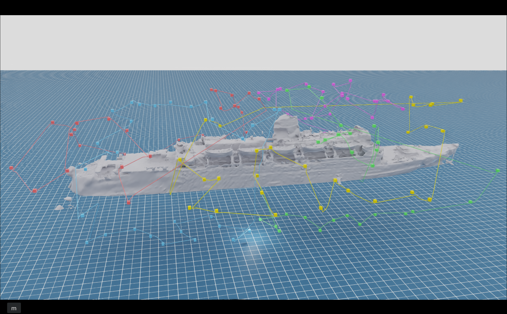

# 3D Inspection

<p align="center">
  
</p>

GPU-accelerated 3D inspection path planning: visibility, VRP, space-time multi-agent path-finding, Isaac Sim simulation.

Full pipeline: [`scripts/run_full_pipeline.py`](scripts/run_full_pipeline.py); replay: [`scripts/visualize_full_pipeline.py`](scripts/visualize_full_pipeline.py). Module reference, configuration, CLI flags: [`docs.md`](docs.md).

## Prerequisites

| Requirement | Version |
|---|---|
| NVIDIA driver | recent enough for CUDA 12.8 (≥ 535) |
| GPU compute capability | ≥ 7.0 (Volta+) |
| Conda / Mamba | any recent |
| Disk free | ~15 GB |
| NVIDIA OptiX SDK | ≥ 7.7 (developed against 8.0.0) |

OptiX is gated behind a free NVIDIA developer account (<https://developer.nvidia.com/login>). Download the Linux installer from <https://developer.nvidia.com/designworks/optix/download>, run it (`chmod +x ... && ./...`) to unpack to e.g. `$HOME/NVIDIA-OptiX-SDK-8.0.0`, then point `OptiX_INSTALL_DIR` at that directory in step 5 below — `triro` won't build without it.

## Setup

One conda env:

```bash
conda create -n inspection python=3.11 -y
conda activate inspection

# torch BEFORE triro (build-time dep)
pip install torch==2.7.0 torchvision==0.22.0 torchaudio==2.7.0 \
    --index-url https://download.pytorch.org/whl/cu128

# IsaacSim 5.0 (~12 GB)
pip install "isaacsim[all]==5.0.0.0" \
    --extra-index-url https://pypi.nvidia.com

# RAPIDS pinned to 26.2 (26.4 ships numba 0.64 which conflicts with isaacsim-core's numba==0.59.1).
pip install cupy-cuda12x "cudf-cu12==26.2.*" "cugraph-cu12==26.2.*" "cuopt-cu12==26.2.*" \
    --extra-index-url https://pypi.nvidia.com

# triro (OptiX raycasting bindings) — not on PyPI.
export OptiX_INSTALL_DIR=$HOME/NVIDIA-OptiX-SDK-8.0.0   # adjust
pip install "git+https://github.com/lcp29/trimesh-ray-optix.git"

pip install -e .          # add [test] for pytest
```

## External assets

- **Mesh:** default `models/duke_of_lancaster_uk_clipped.glb` (loaded by `VRP/core/constants.py:MESH_PATH`, rescaled to 50 m via `--mesh_target_length`). Drop other `.glb`/`.obj`/`.stl` into `models/` to swap.
- **TOSCA / Stanford meshes:** not redistributed here — see [Third-party datasets](#third-party-datasets).
- **BROV USD** (optional, replay only, ~345 MB): `assets/robot/brov/BROV_high.usd`. Without it, `--use-brov-usd` falls back to cuboids. Source: NVIDIA's OceanSim README (<https://github.com/umfieldrobotics/OceanSim>).

## Third-party datasets

Neither dataset below is redistributed in this repository. Both are third-party
material used here for research only; fetch them yourself and respect their
terms. **The committed results under `experiments/results/` do not depend on
having them** — only re-running the experiments does.

### TOSCA (nine non-rigid meshes: `cat`, `centaur`, `david`, `dog`, `gorilla`, `horse`, `michael`, `victoria`, `wolf`)

Bronstein, Bronstein & Kimmel, *Numerical Geometry of Non-Rigid Shapes*,
Springer, 2009 (<https://doi.org/10.1007/978-0-387-73301-2>). TOSCA carries **no
explicit licence**; it has historically been distributed by permission of the
authors. Cite the book if you use it.

Expected layout — `experiments/common/config.py:TOSCA_DIR` reads
`models/TOSCA-dataset/<name>.off`:

```
models/TOSCA-dataset/
├── cat0.off  cat1.off  …          # 80 .off meshes
└── camera_cat.txt …               # 9 camera files (unused by this project)
```

Canonical source, as cited by the original authors and by PyTorch Geometric's
`torch_geometric.datasets.TOSCA`:

```
http://tosca.cs.technion.ac.il/data/toscahires-asci.zip
```

⚠️ **This URL is unreachable as of 2026-08-20.** It 301-redirects to a malformed
address (`https://cis.cs.technion.ac.ilbook/...`, missing a `/`), and
`cis.cs.technion.ac.il` does not respond. PyTorch Geometric points at the same
dead URL, so its loader fails too. If you need the data, contact the authors, or
obtain it from a lab that already holds a copy. If the host comes back:

```bash
mkdir -p models/TOSCA-dataset && cd models/TOSCA-dataset
curl -LO http://tosca.cs.technion.ac.il/data/toscahires-asci.zip
unzip -j toscahires-asci.zip && rm toscahires-asci.zip
```

### Stanford scans (`armadillo`, `dragon`, `happy_buddha`, `xyz_dragon`)

The Stanford 3D Scanning Repository
(<http://graphics.stanford.edu/data/3Dscanrep/>). **Not open-source**: research
use and publication of images in a scholarly article are permitted *provided
credit is given to the Stanford Computer Graphics Laboratory*; commercial use is
not. The Buddha and Dragon additionally carry a request to keep renderings in
good taste. Download the `.ply` files from the repository into the directory
named by `EXTRA_MESHES_DIR` (already gitignored as `models/extra_real/`).


## Quickstart

```bash
conda activate inspection

python scripts/run_full_pipeline.py --solver cuopt    # writes outputs/full_pipeline/

# Isaac Sim replay. Keys: N/→ next, P/← prev, Q/Esc quit.
python scripts/visualize_full_pipeline.py outputs/full_pipeline

python -m pytest tests/ -v
```

Full CLI reference: *Scripts* section of [`docs.md`](docs.md).

## Documentation

- [`docs.md`](docs.md) — architecture, layout, full module reference, constants, CLI flags, experiment/test indices.

## Use of AI tools

Developed as part of a Bachelor thesis at MFF UK (Charles University). Per Article 4 of Dean's Directive 26/2023: I used **Claude Code** (Anthropic's coding assistant, primarily Claude Opus 4 family) throughout this codebase. Work was driven by detailed specifications I authored, refined, and reviewed line by line; AI output was never accepted unmodified.

Algorithmic contributions claimed in the thesis (GPU batch adaptation of Lien's ε-visibility, β-aware per-vehicle tour upper bound with forbidden-pair cuts, 4D space-time extension of Zhou & Zeng's GPU parallel-frontier A*) are my own designs; AI was an implementation aid. Detailed disclosure in thesis Preface "Use of AI tools".
